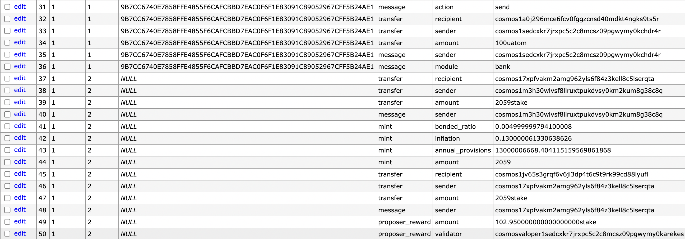

## Cosmoscout
Cosmoscout is an explorer service for cosmos based blockchain.

It's inherently built for enterprise-level.

### Install diesel
```shell
# if you're on linux OS, must install prerequisite of postgresql dev tools,
$ sudo apt install libpq-dev

# install diesel
$ cargo install diesel_cli --no-default-features --features postgres
```

### Run on localhost for test
```shell
# this command runs simple gaiad app & postgres database
# when you run services via this scripts, sample tx will be automatically sent every seconds.
$ docker-compose -f docker-compose.flood.yml up

# migrate schema
$ cd models && diesel migration run && cd ..

# this start to run explorer runtime application
$ RUST_LOG=info cargo run --bin fetcher -- --filename config.toml
```

### Revoke migration
```shell
$ diesel migration redo
```

### Crawling tendermint data
At this time, I crawled only block, transaction and events.

If you need more, Please open the issue.

